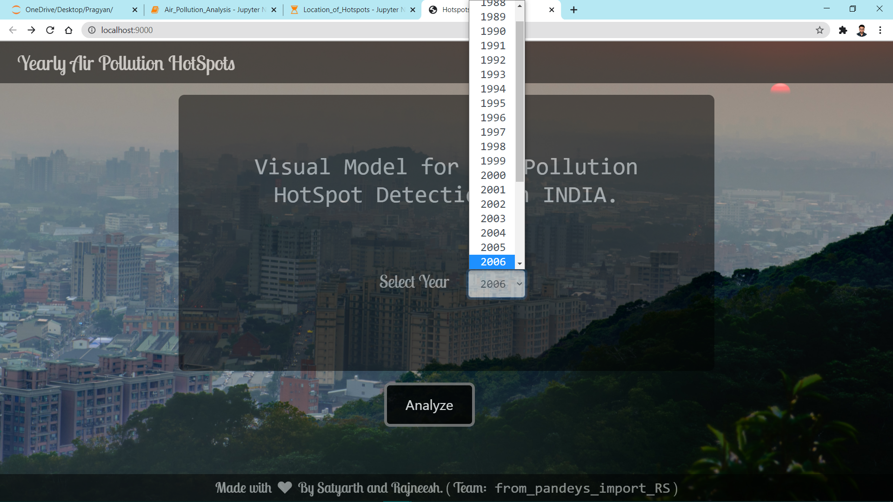
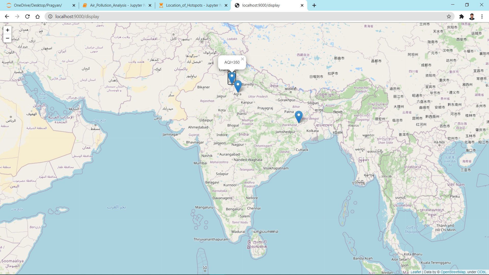
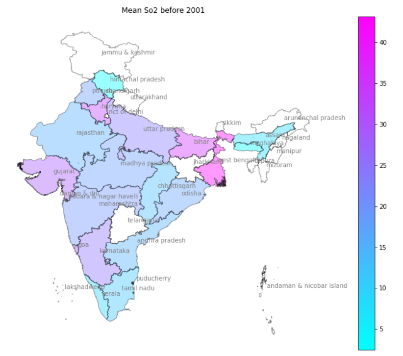
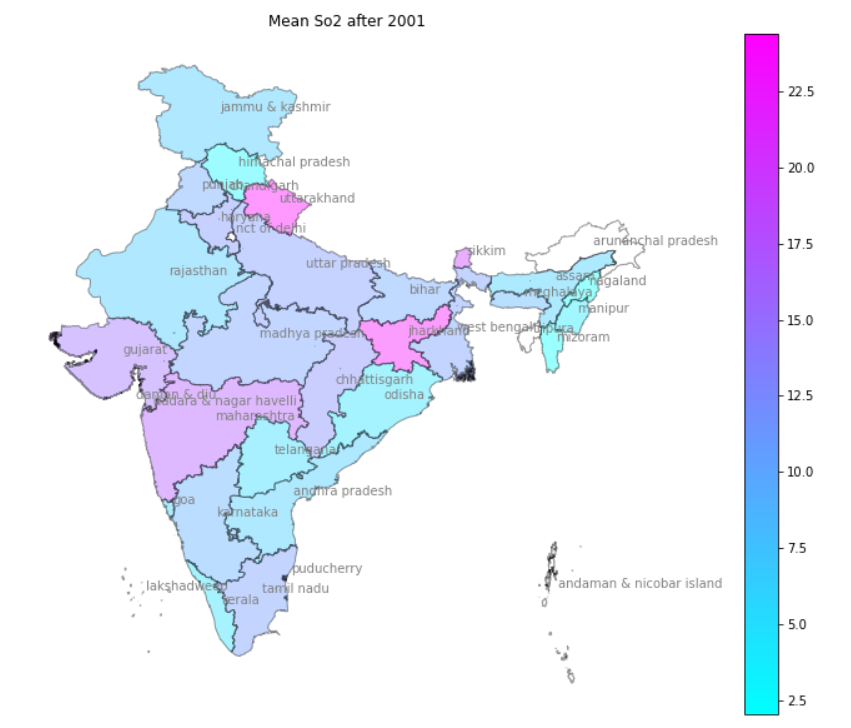
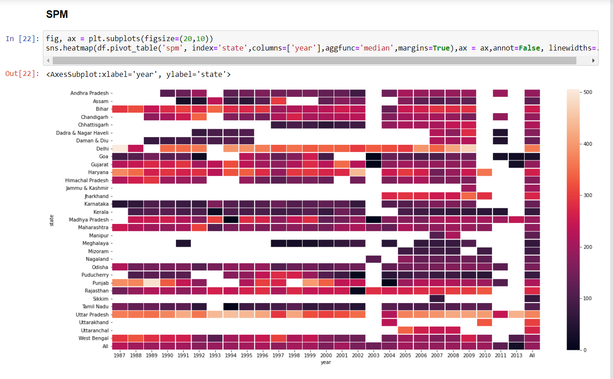
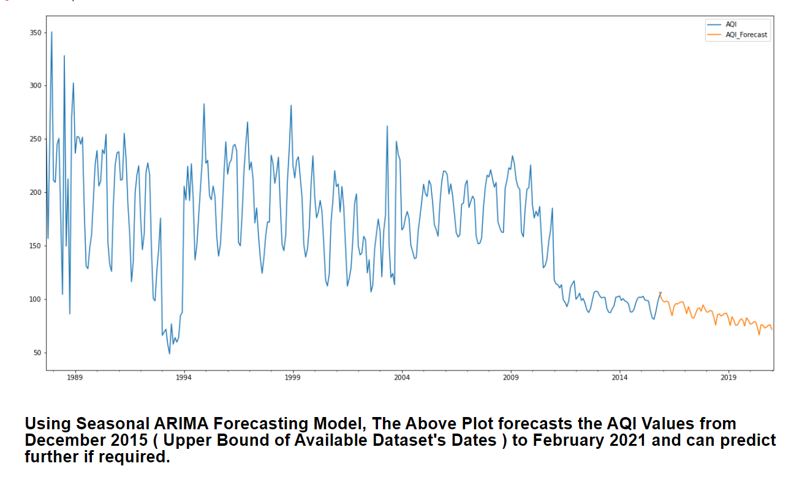
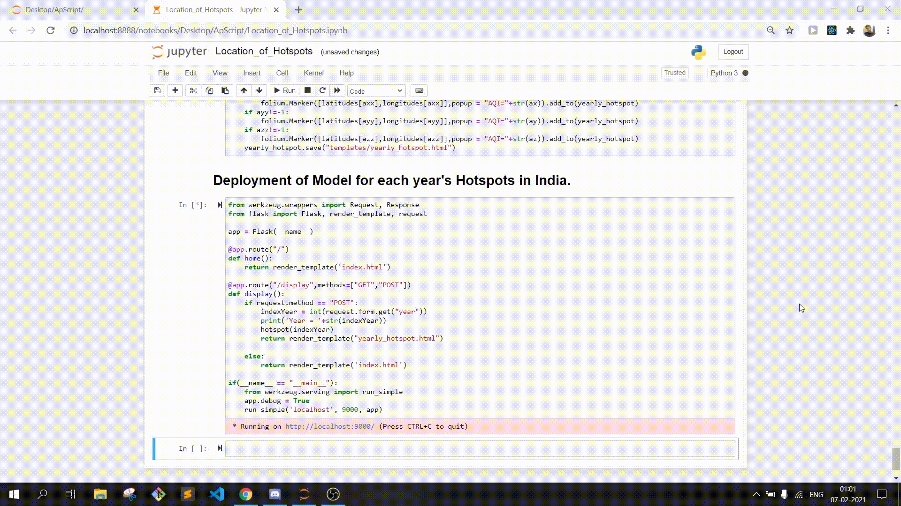

## M3 : Air pollution Hotspots Detection and Identifying the Source Trajectories using ML/AI techniques.
<ul>
<li>
	Identify Yearly Hotspots by calculating AQI from major Pollutants among all States and UTs (India).</li>
<li>Plot Geographical Data of Hotspots and Deploy using Flask with Front-end (HTML & CSS).
<li>
	Visualize Source Trajectory of Pollutants over Time on Map.</li>
	<li>Predict Long-Term Pollution Levels with Time Series Analysis using ARIMA and Seasonal ARIMA (Machine Learning Algorithms).</li>
</li>
</ul>

<h2>Some Glimpses:</h2> 
<pre align="center">    </pre>
<pre align = "center">    </pre>
<pre align = "center">    </pre>

We made this Project for ApScript Hackathon in ML Domain.

To Get more Insights feel free to checkout the PPT.

<h2> Deployment using <em>Flask</em> for location of Hotspots :</h2>

<h2> Dataset Sources : </h2>
<a href='https://data.gov.in/catalog/historical-daily-ambient-air-quality-data?filters%5Bfield_catalog_reference%5D=1140581&format=json&offset=0&limit=6&sort%5Bcreated%5D=desc'> Open Government Data (OGD) Platform India</a>
 
<a href='https://eosweb.larc.nasa.gov/project/mopitt/mopitt_table'>MOPITT</a>
 
<a href='https://giovanni.gsfc.nasa.gov/giovanni/#service=TmAvMp&starttime=&endtime=&dataKeyword=Ozone'>Aura/OMI</a>
